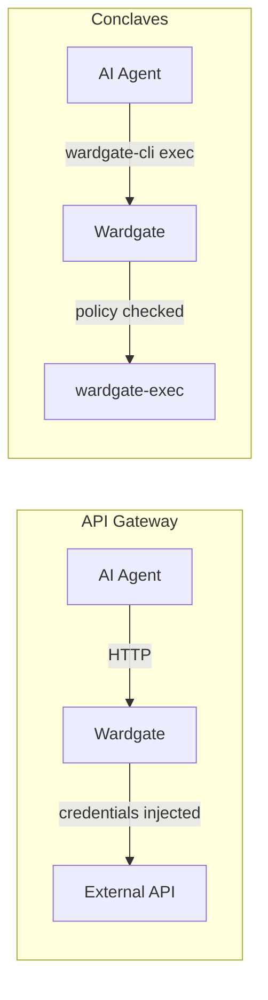

<p align="center">
  
</p>

<p align="center">
  <a href="https://github.com/wardgate/wardgate/actions/workflows/ci.yml"></a>
  <a href="https://goreportcard.com/report/github.com/wardgate/wardgate"></a>
  
  <a href="LICENSE"></a>
</p>

# Wardgate - AI Agent Security Gateway

*Wardgate* is a security gateway that sits between AI agents and the outside world -- isolating credentials for API calls, isolating SSH keys for remote command execution, and gating command execution in remote environments (conclaves).

Give your AI agents access to APIs, SSH keys, and shell tools - without giving them your credentials or trusting them with direct execution.

## The Problem

AI agents are powerful. They can manage your calendar, check your email, update your tasks, write code, and automate your life. But to do any of that, they need access to your accounts and your systems.

They are also like a whizzkid-teenager. They know a lot, but they have a mind of their own. They are gullible (to prompt injections). And just like teens, they don't really think. So thinking about consequences is definitely above their pay-grade!

**The API problem.** Containerization is a great way to isolate your agents. But it's not a silver bullet. They still get your credentials via environment variables or another way -- otherwise they can't help you. And projects like [OpenClaw](https://github.com/openclaw/openclaw) have access control features built in, but you have to trust the agent, the application, or all the thousands of commits that it does not change its own permissions.

**The execution problem.** AI agents don't just call APIs -- they execute shell commands. Running commands directly on the agent host is dangerous: prompt injection can lead to `rm -rf /`, data exfiltration via `curl`, or worse. Even with sandboxing, the agent host has access to everything on its filesystem.

*The risk is real:*
- Credentials in prompts can leak through model outputs, logs, or attacks
- Prompt injection can make agents do things you didn't intend
- A compromised agent has the same access you gave it -- to everything
- Shell commands run on the agent host have full filesystem access

## The Solution

Wardgate provides two complementary security layers:

**API Gateway** -- Agents talk to Wardgate. Wardgate talks to APIs, SSH, IMAP or SMTP servers. Your credentials never leave Wardgate.

**Conclaves** -- Isolated remote execution environments. Agents send commands through Wardgate, which evaluates policy before forwarding to an isolated container. The agent host has no direct access to conclave data or binaries.



## Features

### API Gateway

- **Credential Isolation** -- Agents never see your API keys, OAuth tokens, or passwords
- **Access Control** -- Define what each agent can do: read-only calendar, no email deletion, ask before sending
- **Presets** -- Pre-configured settings for popular APIs (Todoist, GitHub, Cloudflare, Google Calendar, Postmark, Sentry, IMAP, SMTP, and more)
- **Protocol Adapters** -- HTTP/REST passthrough, SSH, IMAP and SMTP with REST wrappers
- **Sensitive Data Filtering** -- Automatically block or redact OTP codes, verification links, and API keys in responses

### Conclaves (Remote Execution)

- **Data Isolation** -- Each conclave has access to only its own data (e.g., a notes vault, a code repo)
- **Tool Isolation** -- Each conclave has only the binaries it needs (e.g., `rg`, `git`, `cat`)
- **Network Isolation** -- Conclaves connect outbound to Wardgate only; no inbound ports
- **Pipeline Parsing** -- Pipes and chains are parsed; each command is evaluated individually
- **Command Policy** -- Per-conclave rules with allow/deny/ask, argument pattern matching, and working directory restrictions

### Cross-Cutting

- **Audit Logging** -- Every request and command logged -- know exactly what your agents did
- **Approval Workflows** -- Require human approval for sensitive operations (send email, delete data, `git push`)
- **Anomaly Detection** -- Alert on unusual patterns (suddenly fetching 100 emails, or things from the past?)
- **Admin UI & CLI** -- Web dashboard and CLI for managing approvals, viewing logs, and monitoring activity
- **wardgate-cli** -- Restricted HTTP client and conclave exec tool for agents; replaces `curl` and prevents connections to arbitrary URLs

## Who Is This For?

You want to use AI agents like [OpenClaw](https://github.com/openclaw/openclaw), [AutoGPT](https://github.com/Significant-Gravitas/AutoGPT), or custom LLM tooling -- but you're not comfortable giving them direct access to your life. I'm not sure I'll ever be comfortable with AI agents that have built-in access control.

Wardgate lets you get the benefits of AI automation while keeping a security boundary between the agent and your accounts.

*Use cases:*
- Personal AI assistant with calendar, email, and task access
- Development agents with limited API and git access
- Agents that need to search or edit files in isolated environments (notes, code repos)
- Multi-agent setups where you want isolation between agents
- Anywhere you'd otherwise paste credentials into an agent's config

## Quick Examples

### API Gateway (HTTPS)

Instead of giving your agent a Todoist API key, configure Wardgate with a [preset](docs/presets.md):

```yaml
endpoints:
  todoist:
    preset: todoist
    auth:
      credential_env: WARDGATE_CRED_TODOIST_API_KEY
    capabilities:
      read_data: allow       # Read tasks, projects
      create_tasks: allow    # Create new tasks
      close_tasks: allow     # Mark tasks complete
      delete_tasks: deny     # Never delete
```

Your agent calls `https://wardgate.internal/todoist/tasks` -- Wardgate injects the real credentials and enforces your rules.

### API Gateway (SSH)

Instead of giving your agent a SSH key, configure Wardgate with a [preset](docs/presets.md):

```yaml
endpoints:
  ssh:
    preset: ssh
    ssh:
      host: prod.example.com
      username: deploy
      known_host: "prod.example.com ssh-ed25519 AAAAC3NzaC1lZDI1NTE5AAAA..."
    auth:
      credential_env: WARDGATE_SSH_KEY_PROD
    capabilities:
      exec_commands: ask  # Require approval for every command
```

### Conclave

Instead of letting your agent run commands on the host, configure a conclave:

```yaml
conclaves:
  obsidian:
    description: "Obsidian vault (personal notes)"
    key_env: WARDGATE_CONCLAVE_OBSIDIAN_KEY
    cwd: /data/vault
    rules:
      - match: { command: "cat" }
        action: allow
      - match: { command: "rg" }
        action: allow
      - match: { command: "tee" }
        action: ask          # Human approval required
      - match: { command: "*" }
        action: deny
```

Your agent runs `wardgate-cli exec obsidian "rg 'meeting notes' ."` -- Wardgate checks each command against policy before forwarding to the isolated environment.

## Quick Start

```bash
cp .env.example .env           # Add your credentials
cp config.yaml.example config.yaml  # Configure endpoints and conclaves

./wardgate -config config.yaml
```

See [INSTALL.md](INSTALL.md) for all installation methods (pre-built binaries, Docker, building from source).

## Documentation

- [Installation](INSTALL.md) -- Pre-built binaries, Docker, building from source
- [Security Architecture](docs/architecture.md) -- How Wardgate protects your credentials
- [Policy System](docs/policies.md) -- Writing and configuring rules
- [Presets Reference](docs/presets.md) -- Built-in presets and capabilities
- [Configuration Reference](docs/config.md) -- All configuration options
- [Conclaves](docs/conclaves.md) -- Isolated remote execution environments
- [wardgate-cli](docs/wardgate-cli.md) -- Restricted HTTP client and conclave exec for agents
- [wardgate-cli AI Skill](skills/wardgate-cli/SKILL.md) -- Skill file to teach AI agents how to use wardgate-cli
- [Deployment Guide](docs/deployment.md) -- Docker, Caddy, and production setup

## Testing

```bash
go test ./...
```
