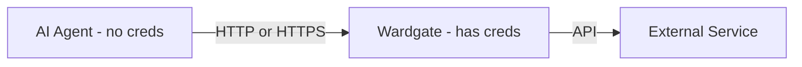

<p align="center">
  
</p>

<p align="center">
  <a href="https://github.com/wardgate/wardgate/actions/workflows/ci.yml"></a>
  <a href="https://goreportcard.com/report/github.com/wardgate/wardgate"></a>
  
  <a href="LICENSE"></a>
</p>

# Wardgate - AI Agent Security Gateway

*Wardgate* is a security proxy that sits between AI agents and external services, providing credential isolation, access control, and audit logging.

Give your AI agents API access - without giving them your credentials.

## The Problem

AI agents are powerful. They can manage your calendar, check your email, update your tasks, and automate your life. But to do that, they need access to your accounts.

They are also like a whizzkid-teenager. They know a lot, but they have a mind of their own. They are gullible (to prompt injections). And just like teens, they don't really think. So thinking about consequences is definitely above their pay-grade!

Containerization is a great way to isolate your agents. But it's not a silver bullet. You still need to be careful about what you put in your containers. They still get your credentials via environment variables or another way. Otherwise they can't help you.

And projects like [OpenClaw](https://github.com/openclaw/openclaw) have all these access control features built in. But unless you gutted capabilities beyond being useful, you have to trust the agent, the application or all the thousands of commits / pull requests that it does not change its own permissions or capabilities and actually does what you want it to do.

Do you really want to give your API keys or e-mail access to that? Give an AI agent direct access to your inbox, 2-factor authentication codes, or other sensitive data? Trust that it won't exfiltrate your data or go rogue, after reading some clever prompt injection?

*The risk is real:*
- Credentials in prompts can leak through model outputs, logs, or attacks
- Prompt injection can make agents do things you didn't intend
- A compromised agent has the same access you gave it - to everything

## The Solution

Wardgate sits between your agents and the outside world. Agents talk to Wardgate. Wardgate talks to APIs. Your credentials never leave Wardgate.




*What Wardgate gives you:*

- *Credential Isolation* - Agents never see your API keys, OAuth tokens, or passwords
- *Access Control* - Define what each agent can do: read-only calendar, no email deletion, ask before sending
- *Sensitive Data Filtering* - Automatically block or redact OTP codes, verification links, and API keys in responses
- *Protocol Adapters* - HTTP/REST passthrough, IMAP and SMTP with REST wrappers
- *Audit Logging* - Every request logged (metadata only, not content) - know exactly what your agents did
- *Approval Workflows* - Require human approval for sensitive operations (send email, delete data)
- *Anomaly Detection* - Alert on unusual patterns (suddenly fetching 100 emails, or a specific folder, or things from the past?)

## Who Is This For?

You want to use AI agents like [OpenClaw](https://github.com/openclaw/openclaw), [AutoGPT](https://github.com/Significant-Gravitas/AutoGPT), or custom LLM tooling - but you're not comfortable giving them direct access to your life. I'm not sure I'll ever be comfortable with AI agents that have built-in access control.

Wardgate lets you get the benefits of AI automation while keeping a security boundary between the agent and your accounts.

*Use cases:*
- Personal AI assistant with calendar, email, and task access
- Development agents with limited API access
- Multi-agent setups where you want isolation between agents
- Anywhere you'd otherwise paste credentials into an agent's config

## Quick Example

So if you want your agent to be able to read your Todoist tasks, you can configure Wardgate to allow it to do so.

Instead of giving your agent a Todoist API key:

# Agent config (dangerous)
```yaml
todoist_api_key: "abc123..."
```

You configure Wardgate using a **[preset](docs/presets.md)** (easiest):

```yaml
# Wardgate config - using preset (recommended)
endpoints:
  todoist:
    preset: todoist
    auth:
      credential_env: WARDGATE_CRED_TODOIST_API_KEY
    capabilities:
      read_data: allow       # Read tasks, projects
      create_tasks: allow    # Create new tasks
      close_tasks: allow     # Mark tasks complete
      delete_tasks: deny     # Never delete
```

Or with full manual configuration:

```yaml
# Wardgate config - manual (for custom APIs)
endpoints:
  todoist-api:
    upstream: https://api.todoist.com/rest/v2
    auth:
      type: bearer
      credential_env: WARDGATE_CRED_TODOIST_API_KEY
    rules:
      - match: { method: GET }
        action: allow
      - match: { method: DELETE }
        action: deny
      - match: { method: "*" }
        action: ask  # Human approval required
```

Your agent calls https://wardgate.internal/todoist/tasks - Wardgate injects the real credentials and enforces your rules.

## Quick Start

```bash
# Copy and edit .env file
cp .env.example .env
# Edit .env with your credentials

# Copy and edit config.yaml file
cp config.yaml.example config.yaml
# Edit config.yaml with your configuration

# Run (automatically loads .env)
./wardgate -config config.yaml

# Or specify a different env file
./wardgate -config config.yaml -env /path/to/.env
```

## Usage

Agents make requests to the gateway instead of directly to APIs:

```bash
# Instead of: curl -H "Authorization: Bearer $TODOIST_KEY" https://api.todoist.com/rest/v2/tasks
# Use:
curl -H "Authorization: Bearer $AGENT_KEY" http://localhost:8080/todoist-api/tasks
```

The gateway:
1. Validates the agent's key
2. Evaluates policy rules (allow/deny)
3. Injects the real API credential
4. Forwards the request to the upstream
5. Logs the request/response
6. Returns the response to the agent

## Documentation

- [Security Architecture](docs/architecture.md) - How Wardgate protects your credentials
- [Policy System](docs/policies.md) - Writing and configuring rules
- [Presets Reference](docs/presets.md) - Built-in presets and capabilities
- [Configuration Reference](docs/config.md) - All configuration options
- [Deployment Guide](docs/deployment.md) - Docker, Caddy, and production setup

## Configuration

See `config.yaml.example` for a quick example, or [Configuration Reference](docs/config.md) for full documentation.

Key sections:

- `server.listen` - Address to listen on (default `:8080`)
- `agents` - List of agents and their key env vars
- `endpoints` - Map of endpoint name to upstream config and rules
- `notify` - Notification settings for approval workflows

## Presets (Easy Setup)

Wardgate includes presets for popular APIs in the `presets/` directory. Just specify the preset name and your credentials:

```yaml
presets_dir: ./presets

endpoints:
  github:
    preset: github
    auth:
      credential_env: WARDGATE_CRED_GITHUB_TOKEN
    capabilities:
      read_data: allow
      create_issues: allow
      create_comments: allow
      create_pull_requests: ask  # Require approval
```

### Available Presets

| Preset | Service | Capabilities |
|--------|---------|--------------|
| `cloudflare` | Cloudflare | read_data, manage_dns, purge_cache, manage_page_rules |
| `github` | GitHub | read_data, create_issues, create_comments, manage_labels, create_pull_requests, manage_releases |
| `google-calendar` | Google Calendar | read_data, create_events, update_events, delete_events |
| `imap` | IMAP Email | list_folders, read_inbox, read_all_folders, mark_read, move_messages |
| `pingping` | PingPing.io | read_data, create_monitors, update_monitors, delete_monitors, manage_checks |
| `plausible` | Plausible | read_data, send_events |
| `postmark` | Postmark | read_data, send_email, send_batch, send_templates |
| `sentry` | Sentry | read_data, resolve_issues, manage_projects |
| `smtp` | SMTP Email | send_email |
| `todoist` | Todoist | read_data, create_tasks, close_tasks, update_tasks, delete_tasks, manage_projects |

Each capability can be set to `allow`, `deny`, or `ask` (require human approval).

### Custom Presets

The easiest way to define new presets is to add a new YAML file in the `presets/` directory.

See [Configuration Reference](docs/config.md#custom-presets-user-defined) for details.

```yaml
# presets/my-api.yaml
name: my-api
description: "My Custom API"
upstream: https://api.example.com
auth_type: bearer
```

But you can also define your own presets in the config file:

```yaml
# In config.yaml
custom_presets:
  my-api:
    description: "My Custom API"
    upstream: https://api.example.com
    auth_type: bearer
    capabilities:
      - name: read_data
        description: "Read resources"
        rules:
          - match: { method: GET }
      - name: write_data
        description: "Write resources"
        rules:
          - match: { method: POST }

endpoints:
  my-api:
    preset: my-api
    auth:
      credential_env: MY_API_KEY
    capabilities:
      read_data: allow
      write_data: ask
```

## Policy Rules

Rules are evaluated in order. First match wins.

```yaml
rules:
  - match: { method: GET }
    action: allow
  - match: { method: POST, path: "/tasks" }
    action: allow
  - match: { method: POST, path: "/tasks/*/close" }  # Glob pattern
    action: allow
  - match: { method: "*" }
    action: deny
    message: "Not permitted"
```

### Supported Actions

| Action | Description |
|--------|-------------|
| `allow` | Pass through immediately |
| `deny` | Block with error message |
| `ask` | Require human approval (blocks until approved/denied/timeout) |

### Path Patterns

- Exact match: `/tasks` matches only `/tasks`
- Wildcard suffix: `/tasks*` matches `/tasks`, `/tasks/123`, `/tasks/123/comments`
- Single segment: `/tasks/*/close` matches `/tasks/123/close` but not `/tasks/a/b/close`
- Multi-segment: `/api/**/status` matches `/api/status`, `/api/v1/status`, `/api/v1/tasks/status`

### Rate Limiting

Limit requests per agent per time window:

```yaml
rules:
  - match: { method: GET }
    action: allow
    rate_limit:
      max: 100        # Maximum requests
      window: "1m"    # Per minute (supports: s, m, h)
```

### Time-Based Rules

Restrict when rules apply:

```yaml
rules:
  - match: { method: POST }
    action: allow
    time_range:
      hours: ["09:00-17:00"]  # Only during business hours
      days: ["mon", "tue", "wed", "thu", "fri"]  # Weekdays only
```

### Ask Workflow (Human Approval)

For sensitive operations, require human approval:

```yaml
# In endpoint rules
rules:
  - match: { method: DELETE }
    action: ask  # Requires human approval

# Configure notifications
notify:
  timeout: "5m"  # How long to wait for approval
  slack:
    webhook_url: "https://hooks.slack.com/services/..."
  # Or use a generic webhook
  webhook:
    url: "https://your-webhook.example.com/notify"
    headers:
      Authorization: "Bearer token"
```

When an `ask` rule matches:
1. Agent request blocks
2. Notification sent to Slack/webhook with link to dashboard
3. Human reviews request in Web UI and approves or denies
4. Request proceeds or returns 403

## wardgate-cli

Give agents `wardgate-cli` instead of `curl` to limit their network access. It uses curl-like arguments but only connects to your Wardgate server-agents cannot redirect to arbitrary URLs. See [wardgate-cli documentation](docs/wardgate-cli.md) for setup and security details.

## Endpoint Discovery API

Agents can discover available endpoints via `GET /endpoints`:

```bash
curl -H "Authorization: Bearer $AGENT_KEY" http://localhost:8080/endpoints
```

Response:
```json
{
  "endpoints": [
    {"name": "todoist", "description": "Todoist API (Personal)", "upstream": "https://api.todoist.com/api/v1", "docs_url": "https://developer.todoist.com/api/v1/"},
    {"name": "imap-personal", "description": "IMAP (personal@example.com)"},
    {"name": "smtp-personal", "description": "SMTP (personal@example.com)"}
  ]
}
```

`upstream` and `docs_url` are optional; they come from presets or endpoint config and help agents understand the API version and find documentation.

The description comes from (in priority order):
1. `description` field in endpoint config
2. Preset description (if using a preset)
3. Adapter name (IMAP, SMTP, HTTP)

The description is meant for the agent to understand which API it is supposed to assume is behind it.

## Admin UI & CLI

Wardgate includes a web dashboard and CLI for managing approval requests.

### Enabling the Admin UI

Add an admin key to your configuration:

```yaml
server:
  listen: ":8080"
  admin_key_env: WARDGATE_ADMIN_KEY
```

Set the key in your environment:

```bash
export WARDGATE_ADMIN_KEY=your-secret-admin-key
```

Access the dashboard at `http://localhost:8080/ui/`. Enter your admin key to login.

### CLI Usage

The same binary provides CLI commands for managing approvals:

```bash
# Set environment variables
export WARDGATE_URL=http://localhost:8080
export WARDGATE_ADMIN_KEY=your-secret-admin-key

# List pending approvals
wardgate approvals list

# View details of an approval (including email content for SMTP)
wardgate approvals view <id>

# Approve or deny
wardgate approvals approve <id>
wardgate approvals deny <id>

# View history of recent decisions
wardgate approvals history

# Monitor mode - live updates with interactive approve/deny
wardgate approvals monitor
```

The Web UI and CLI show full request content for email approvals, allowing you to review the recipient, subject, and body before approving.

### Logging Dashboard

The Web UI includes a **Logs** tab that shows recent request activity. Logs are stored in memory (ring buffer) and can be filtered by:

- Endpoint
- Agent
- Decision (allow/deny/rate_limited/error)
- HTTP method

Configure logging in your `config.yaml`:

```yaml
server:
  logging:
    max_entries: 1000      # Max entries to keep (default: 1000)
    store_bodies: false    # Store request bodies (default: false)
```

**Note:** Logs are stored in memory only and are lost on restart. For persistent logging, configure your log aggregator to consume stdout.

## IMAP Support

Wardgate can proxy IMAP servers via a REST API, letting your agents read email without direct IMAP access:

```yaml
endpoints:
  imap-personal:
    adapter: imap
    upstream: imaps://imap.gmail.com:993
    auth:
      type: plain
      credential_env: IMAP_CREDS  # format: username:password
    rules:
      - match: { path: "/inbox*" }
        action: allow
      - match: { path: "/*" }
        action: deny
```

REST endpoints exposed:
- `GET /folders` - List mailbox folders
- `GET /folders/{folder}?limit=N&since=DATE` - Fetch messages from folder
- `GET /folders/{folder}/messages/{uid}` - Get full message by UID
- `POST /folders/{folder}/messages/{uid}/mark-read` - Mark message as read
- `POST /folders/{folder}/messages/{uid}/move?to=X` - Move message to folder

## SMTP Support

Wardgate can send emails via SMTP through a REST API, with approval workflows and content filtering:

```yaml
endpoints:
  smtp-personal:
    adapter: smtp
    upstream: smtps://smtp.gmail.com:465  # Or smtp://...587 for STARTTLS
    auth:
      type: plain
      credential_env: SMTP_CREDS  # format: username:password
    smtp:
      tls: true
      from: "your-email@gmail.com"
      known_recipients:
        - "@company.com"  # Known domain (no approval needed)
      ask_new_recipients: true  # Ask before sending to unknown recipients
      blocked_keywords:
        - "password"
        - "secret"
    rules:
      - match: { path: "/send" }
        action: allow
```

REST endpoint exposed:
- `POST /send` - Send an email

**Send request body:**
```json
{
  "to": ["recipient@example.com"],
  "cc": ["cc@example.com"],
  "bcc": ["bcc@example.com"],
  "reply_to": "reply@example.com",
  "subject": "Email subject",
  "body": "Plain text body",
  "html_body": "<html>...</html>"
}
```

**SMTP Features:**
- *Content filtering* - Block emails containing specific keywords
- *Recipient allowlisting* - Only allow sending to approved recipients
- *Ask for new recipients* - Require human approval when sending to unknown recipients
- *HTML and plain text* - Support for multipart emails

## Sensitive Data Filtering

Wardgate automatically detects and blocks sensitive data in API responses and emails. This prevents agents from seeing:

- **OTP codes** - "Your verification code is 123456"
- **Verification links** - Email confirmation and password reset URLs
- **API keys** - OpenAI, GitHub, Slack, AWS keys in responses

Filtering is **enabled by default**. Configure per-endpoint:

```yaml
endpoints:
  # Normal email - block OTPs (default)
  mail-personal:
    preset: imap
    auth:
      credential_env: WARDGATE_CRED_IMAP
    # filter.enabled is true by default

  # OTP inbox - allow agent to read codes
  mail-otp:
    preset: imap
    auth:
      credential_env: WARDGATE_CRED_IMAP_OTP
    filter:
      enabled: false  # Disable for OTP reading
```

Actions: `block` (default), `redact`, `ask`, or `log`. See [Configuration Reference](docs/config.md#sensitive-data-filtering) for details.

## Building

```bash
go build -o wardgate ./cmd/wardgate
go build -o wardgate-cli ./cmd/wardgate-cli
```

**wardgate-cli** uses a fixed config path (default `/etc/wardgate-cli/config.yaml`) so agents cannot override it. To use a different path at build time:

```bash
go build -ldflags "-X main.configPath=$HOME/.wardgate-cli.yaml" -o wardgate-cli ./cmd/wardgate-cli
```

## Docker Deployment

```bash
# Create config directory and copy files
mkdir -p config
cp config.yaml.example config/config.yaml
cp .env.example config/.env

# Edit config/config.yaml and config/.env with your settings

# Run with Docker Compose (includes Caddy for HTTPS)
docker compose up -d

# Or for production with a custom domain
DOMAIN=wardgate.example.com docker compose up -d
```

See [Deployment Guide](docs/deployment.md) for more options.

## Testing

```bash
go test ./...
```