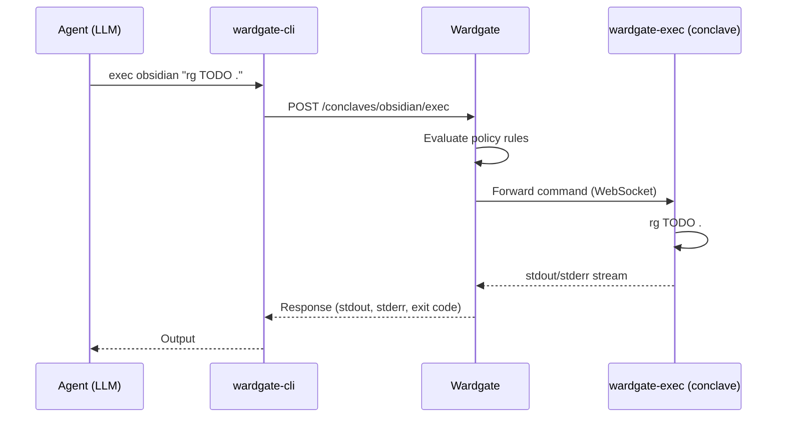

# Conclaves (Remote Execution Environments)

A **conclave** is an isolated execution environment with specific data and tools, accessible only through Wardgate. Instead of running commands locally on the agent host, agents send commands to conclaves via `wardgate-cli exec`, and Wardgate evaluates policy rules before forwarding them for execution.

## Why

AI agents don't just call APIs - they execute shell commands. Running commands directly on the agent host is dangerous: prompt injection can lead to `rm -rf /`, data exfiltration via `curl`, or worse. Even with local exec gating, the agent host has access to everything on its filesystem.

Conclaves solve this by moving execution to isolated environments:

- **Data isolation** - Each conclave has access to only its own data (e.g., a notes vault, a code repo)
- **Tool isolation** - Each conclave has only the binaries it needs (e.g., `rg`, `git`, `cat`)
- **Network isolation** - Conclaves connect outbound to Wardgate only; no inbound ports
- **Policy enforcement** - Wardgate evaluates every command against per-conclave rules before forwarding

## Architecture



### Components

| Component | Role |
|-----------|------|
| `wardgate-cli` | Agent-side CLI. Parses commands, sends to Wardgate |
| `wardgate` | Gateway. Evaluates policy, routes to conclave via WebSocket |
| `wardgate-exec` | Runs inside each conclave. Connects to Wardgate, executes commands |

### Connection Flow

1. `wardgate-exec` starts in the conclave and connects **outbound** to Wardgate via WebSocket
2. Wardgate authenticates the connection using a pre-shared key
3. The connection stays open - Wardgate can send commands at any time
4. When an agent runs `wardgate-cli exec <conclave> "<command>"`:
   - `wardgate-cli` parses the command and sends segments + raw command to Wardgate
   - Wardgate evaluates each segment against the conclave's policy rules
   - If allowed, Wardgate forwards the command to `wardgate-exec` via WebSocket
   - `wardgate-exec` runs the command and streams stdout/stderr back
   - Wardgate returns the output to the agent

## Configuration

### Wardgate Server (`config.yaml`)

```yaml
conclaves:
  obsidian:
    description: "Obsidian vault (personal notes)"
    key_env: WARDGATE_CONCLAVE_OBSIDIAN_KEY
    agents: [tessa]  # Only agent "tessa" can access (omit for all agents)
    cwd: /data/vault
    rules:
      # Read-only tools
      - match: { command: "cat" }
        action: allow
      - match: { command: "rg" }
        action: allow
      - match: { command: "head" }
        action: allow
      - match: { command: "ls" }
        action: allow
      # Write tools require approval
      - match: { command: "tee" }
        action: ask
      - match: { command: "cp" }
        action: ask
      # Default deny
      - match: { command: "*" }
        action: deny
        message: "Command not in allowlist"

  code:
    description: "Code repository"
    key_env: WARDGATE_CONCLAVE_CODE_KEY
    cwd: /home/dev/project
    rules:
      - match: { command: "git", args_pattern: "^(status|log|diff|show|branch)" }
        action: allow
      - match: { command: "git", args_pattern: "^(push|commit|rebase|reset)" }
        action: ask
      - match: { command: "rg" }
        action: allow
      - match: { command: "make" }
        action: ask
      - match: { command: "*" }
        action: deny
```

### wardgate-exec (`config.yaml`)

Each conclave runs `wardgate-exec` with its own config:

```yaml
server: wss://wardgate.example.com/conclaves/ws
key: "conclave-secret-key"
name: obsidian

# Optional: local allowlist (defense in depth)
allowed_bins:
  - cat
  - rg
  - head
  - ls
  - tee
  - cp

# Optional: output limits
max_input_bytes: 1048576    # 1MB (default)
max_output_bytes: 10485760  # 10MB (default)
```

The local `allowed_bins` acts as a second layer - even if Wardgate allows a command, `wardgate-exec` will reject it if it's not in the local allowlist.

## Policy Rules

Conclave rules use the same match fields as endpoint rules:

| Field | Type | Description |
|-------|------|-------------|
| `command` | glob | Match on the command name (resolved to absolute path on the conclave) |
| `args_pattern` | regex | Match on the joined argument string |
| `cwd_pattern` | glob | Match on the working directory |

### Command Matching

```yaml
- match: { command: "rg" }              # matches rg (resolved to /usr/bin/rg)
- match: { command: "python*" }         # python, python3, python3.11
- match: { command: "*" }               # any command (catch-all)
```

Commands sent by the agent are resolved to absolute paths on the conclave before execution.

### Args Matching

```yaml
- match: { command: "git", args_pattern: "^(status|log|diff)" }  # git read ops
- match: { command: "git", args_pattern: "^push" }               # git push
```

### Working Directory Matching

```yaml
- match: { command: "*", cwd_pattern: "/data/vault/**" }   # only in vault
- match: { command: "git", cwd_pattern: "/home/dev/**" }   # git only in dev home
```

## Command Templates

Instead of allowing full shell access, you can define **command templates** - pre-made commands where the agent only provides arguments. This is the recommended approach when you want to expose specific operations without granting broad tool access.

### Configuration

```yaml
conclaves:
  obsidian:
    key_env: WARDGATE_CONCLAVE_OBSIDIAN_KEY
    cwd: /data/vault
    commands:
      search:
        description: "Search notes by filename"
        template: "find . -iname {query}"
        args:
          - name: query
            description: "Filename pattern"
      grep:
        description: "Search note contents (secrets filtered)"
        template: "rg {pattern} | grep -v SECRET1 | grep -v SECRET2"
        args:
          - name: pattern
            description: "Text pattern"
        action: ask  # require approval
      status:
        description: "Show vault file listing"
        template: "ls -la"
```

### How It Works

1. The agent calls `wardgate-cli run obsidian search "*.md"`
2. Wardgate looks up the `search` command definition
3. The `{query}` placeholder is replaced with `'*.md'` (shell-escaped)
4. The expanded command `find . -iname '*.md'` is sent to the conclave

Defining a command IS the policy - no rules evaluation is needed. The agent can only run the exact command shapes you defined, with their arguments safely shell-escaped.

### Template Fields

| Field | Type | Required | Description |
|-------|------|----------|-------------|
| `description` | string | No | Human-readable description (shown in discovery) |
| `template` | string | Yes | Command string with `{argname}` placeholders |
| `args` | array | No | Ordered list of named arguments |
| `action` | string | No | `allow` (default) or `ask` (require approval) |

### Argument Escaping

All argument values are automatically wrapped in single quotes before substitution, preventing shell injection. For example, an agent passing `; rm -rf /` as an argument produces `'; rm -rf /'` which is treated as a literal string by the shell.

### Discovery

When an agent calls `wardgate-cli conclaves`, the response includes available commands with their descriptions and argument specs, so the agent knows what's available without needing documentation.

### Commands vs Rules

You can use `commands` and `rules` together on the same conclave. Commands provide a safe, restricted interface for common operations, while rules gate raw `exec` access for cases where the agent needs more flexibility.

## Pipeline Support

Agents commonly emit piped commands. `wardgate-cli` parses these and each segment is evaluated individually:

```bash
wardgate-cli exec code "rg TODO src/ | head -20"
```

This is parsed into two segments (`rg` and `head`), each checked against the conclave's policy. Both must be allowed for the command to execute.

### Supported Constructs

| Construct | Example | Handling |
|-----------|---------|----------|
| Pipes | `cmd1 \| cmd2` | Each segment evaluated individually |
| AND chains | `cmd1 && cmd2` | Each segment evaluated individually |
| OR chains | `cmd1 \|\| cmd2` | Each segment evaluated individually |
| Semicolons | `cmd1 ; cmd2` | Each segment evaluated individually |
### Rejected Constructs

These are rejected because they introduce hidden command execution or file modification that cannot be policy-checked:

| Construct | Example | Why rejected |
|-----------|---------|--------------|
| Redirections | `cmd > file` | Uncontrolled file writes (set `allow_redirects: true` to enable) |
| Command substitution | `echo $(cat /etc/passwd)` | Hidden command execution |
| Backticks | `` echo `cat /etc/passwd` `` | Hidden command execution |
| Process substitution | `diff <(cmd1) <(cmd2)` | Hidden command execution |
| Subshells | `(cd /tmp && rm -rf *)` | Hidden command execution |

## wardgate-cli exec

### Usage

```bash
wardgate-cli exec [-C <dir>] <conclave> "<command>"
```

### Options

| Option | Description |
|--------|-------------|
| `-C <dir>` | Set working directory on the conclave (default: conclave's configured `cwd`) |

### Examples

```bash
# Simple command
wardgate-cli exec obsidian "rg 'meeting notes' ."

# Pipeline
wardgate-cli exec code "rg TODO src/ | head -20"

# Chain
wardgate-cli exec code "git add . && git commit -m 'update'"

# With working directory
wardgate-cli exec -C /data/archive obsidian "ls -la"

# List conclaves
wardgate-cli conclaves
```

## Approval UI

When conclave rules use `action: ask`, the approval dashboard shows:

- The conclave name
- The full command string
- The working directory
- The agent ID

Approvers see exactly what will be executed and where before approving or denying.

## Deployment

Each conclave is typically a Docker container running `wardgate-exec`. See the included `Dockerfile.conclave` for an example.

```yaml
# docker-compose.yml
services:
  conclave-obsidian:
    build:
      context: .
      dockerfile: Dockerfile.conclave
    volumes:
      - ./data/vault:/data/vault:ro
      - ./config/conclave-obsidian.yaml:/etc/wardgate-exec/config.yaml:ro
    environment:
      - WARDGATE_CONCLAVE_OBSIDIAN_KEY=your-key
```

Key deployment principles:

- **Mount data read-only** when the conclave only needs to read (`:ro`)
- **Mount config read-only** so `wardgate-exec` config cannot be tampered with
- **Run as non-root** - the `Dockerfile.conclave` creates a dedicated `conclave` user
- **No inbound ports** - `wardgate-exec` connects outbound to Wardgate
- **Local allowlist** - use `allowed_bins` in `wardgate-exec` config for defense in depth

## Security Model

| Layer | Protection |
|-------|-----------|
| Agent host | No direct access to conclave data or binaries |
| `wardgate-cli` | Parses commands, rejects unsafe constructs |
| Wardgate | Per-conclave policy evaluation (allow/deny/ask) |
| `wardgate-exec` | Local allowlist, output size limits |
| Container | Filesystem isolation, network isolation, non-root user |

The agent never sees conclave data directly. It can only interact through commands that pass all policy layers.

## Limitations

- **No interactive commands** - conclaves execute commands and return output; no TTY support
- **Output size limits** - large outputs are truncated to prevent memory exhaustion
- **Single command at a time** - concurrent commands to the same conclave are serialized
- **No file transfer** - agents cannot upload or download files directly; use commands like `cat` and `tee`
