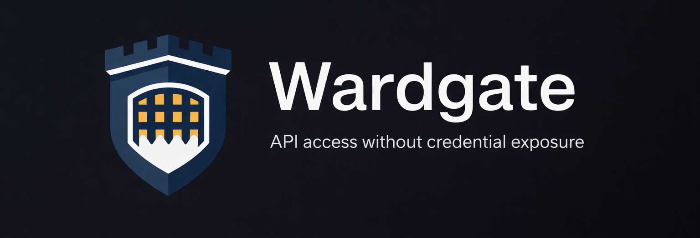

<p align="center">
  
</p>

# Wardgate Documentation

Wardgate is a security gateway for AI agents. It provides credential-isolated API proxying and policy-gated remote command execution (conclaves), with audit logging, approval workflows, and sensitive data filtering.

## Quick Start

### API Gateway -- proxy API calls with credential isolation

```yaml
endpoints:
  todoist:
    preset: todoist
    auth:
      credential_env: WARDGATE_CRED_TODOIST_API_KEY
    capabilities:
      read_data: allow
      create_tasks: allow
      delete_tasks: deny
```

**Included presets:** `todoist`, `github`, `cloudflare`, `google-calendar`, `postmark`, `sentry`, `plausible`, `imap`, `smtp`, `pingping`

### Conclaves -- isolated remote execution for agent commands

```yaml
conclaves:
  obsidian:
    description: "Obsidian vault (personal notes)"
    key_env: WARDGATE_CONCLAVE_OBSIDIAN_KEY
    cwd: /data/vault
    rules:
      - match: { command: "rg" }
        action: allow
      - match: { command: "tee" }
        action: ask
      - match: { command: "*" }
        action: deny
```

## Documentation

### Core Concepts

- [Security Architecture](architecture.md) -- How Wardgate protects your credentials and isolates execution
- [Policy System](policies.md) -- Writing and configuring rules (allow/deny/ask, rate limits, time ranges)

### API Gateway

- [Presets Reference](presets.md) -- Built-in presets, capabilities, and how to create your own
- [Configuration Reference](config.md) -- All configuration options including sensitive data filtering

### Conclaves

- [Conclaves](conclaves.md) -- Isolated remote execution environments, policy rules, deployment
- [wardgate-cli](wardgate-cli.md) -- Restricted HTTP client and conclave exec tool for agents

### Operations

- [Installation](../INSTALL.md) -- Pre-built binaries, Docker, building from source
- [Deployment Guide](deployment.md) -- Docker, Caddy, and production setup

## Admin UI & CLI

Wardgate includes a web dashboard (`/ui/`) and CLI for managing approval requests. Configure `admin_key_env` in your server settings to enable. See the [README](../README.md) for an overview.

The dashboard includes:
- **Pending** -- Requests awaiting approval
- **History** -- Past approval decisions
- **Logs** -- Recent request activity with filtering

## Quick Links

- [GitHub Repository](https://github.com/wardgate/wardgate)
- [README](../README.md)
